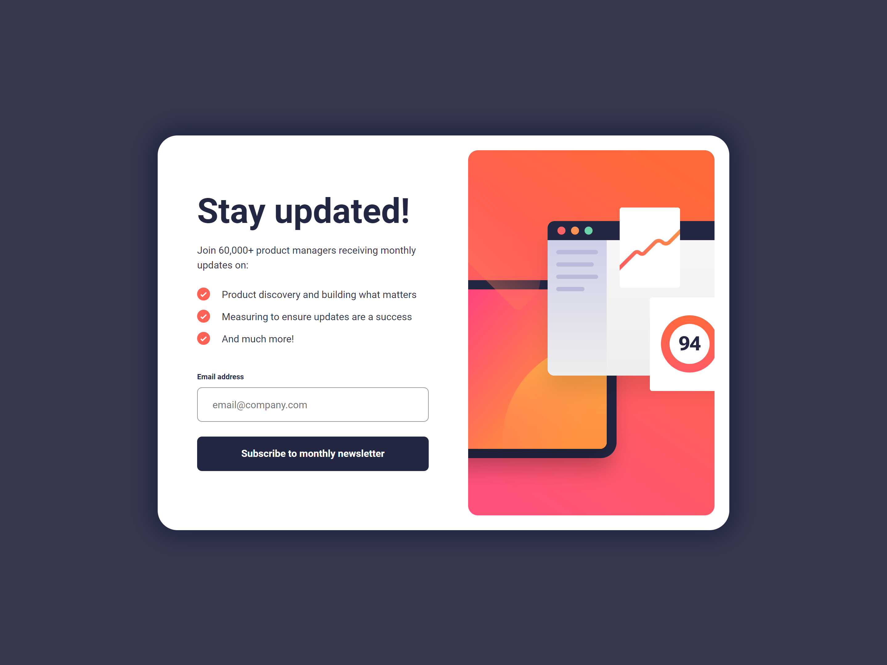
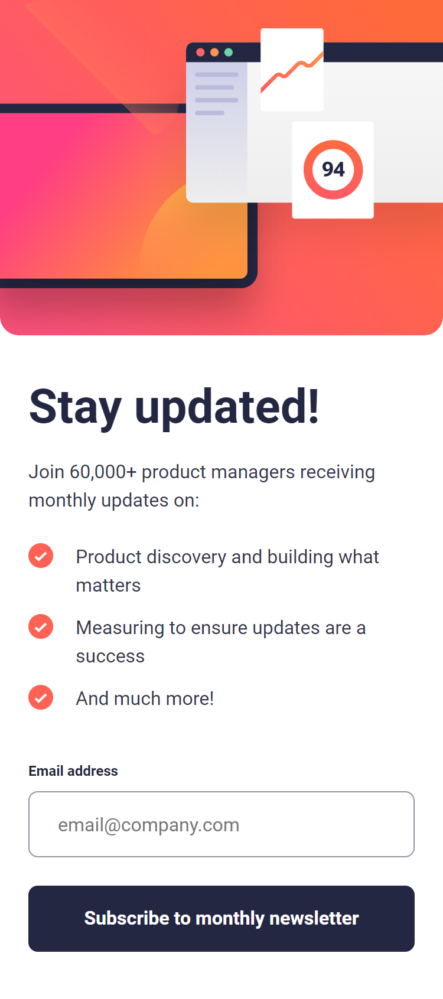

# Frontend Mentor - Newsletter sign-up form with success message solution

This is a solution to the [Newsletter sign-up form with success message challenge on Frontend Mentor](https://www.frontendmentor.io/challenges/newsletter-signup-form-with-success-message-3FC1AZbNrv). Frontend Mentor challenges help you improve your coding skills by building realistic projects.

## Table of contents

-   [Overview](#overview)
    -   [The challenge](#the-challenge)
    -   [Screenshot](#screenshot)
    -   [Links](#links)
-   [My process](#my-process)
    -   [Built with](#built-with)
    -   [What I learned](#what-i-learned)
    -   [Continued development](#continued-development)
    -   [Useful resources](#useful-resources)
-   [Author](#author)

## Overview

### The challenge

Users should be able to:

-   Add their email and submit the form
-   See a success message with their email after successfully submitting the form
-   See form validation messages if:
    -   The field is left empty
    -   The email address is not formatted correctly
-   View the optimal layout for the interface depending on their device's screen size
-   See hover and focus states for all interactive elements on the page

### Screenshot

Desktop version 

Mobile version 

### Links

-   [Solution URL](https://github.com/c0dehamster/newsletter-sign-up-with-success-message)
-   [Live Site URL](https://newsletter-sign-up-with-success-message-59r2.vercel.app/)

## My process

### Built with

-   Semantic HTML5 markup
-   CSS custom properties
-   Flexbox
-   CSS Grid
-   Mobile-first workflow
-   Typescript
-   [React](https://reactjs.org/) - JS library
-   [Vite](https://vitejs.dev/) - build tool
-   [React hook form](https://react-hook-form.com/) - library for handling forms in React

### What I learned

I used this project to get back into writing code after a long break. It did not pose much of a challenge. I was already familiar with most of what I should know to build it.

To avoid writing a custom solution for form validation, I used a library called React hook form. While it wasn't necessary for such a simple task, knowing how to use it can come in handy later.

### Continued development

I attempted make the color of the buttons transition smoothly to gradient on hover but could not make it work. However, while working on it, I learned about CSS Houdini and some of the more advanced ways to use CSS custom properties. As to why it did not work, I am sure the reason is the outdated version of Google Chrome I had to use for testing. Also these features aren't supported in some browsers yet so I don't think I will use them any time soon.

### Useful resources

-   [Magical Rainbow Gradients](https://www.joshwcomeau.com/react/rainbow-button/) - an article by Josh Comeau about using CSS custom properties to animate gradients

## Author

-   Frontend Mentor - [@twDevNoob](https://www.frontendmentor.io/profile/twDevNoob)

### New setup test ###

I am the new me